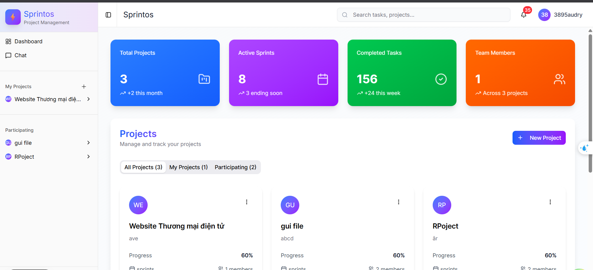
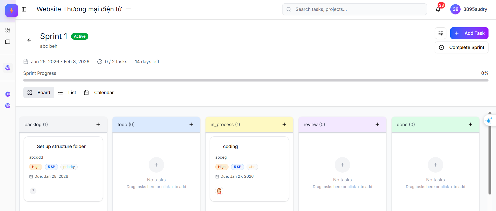
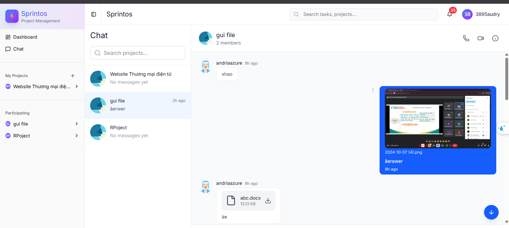
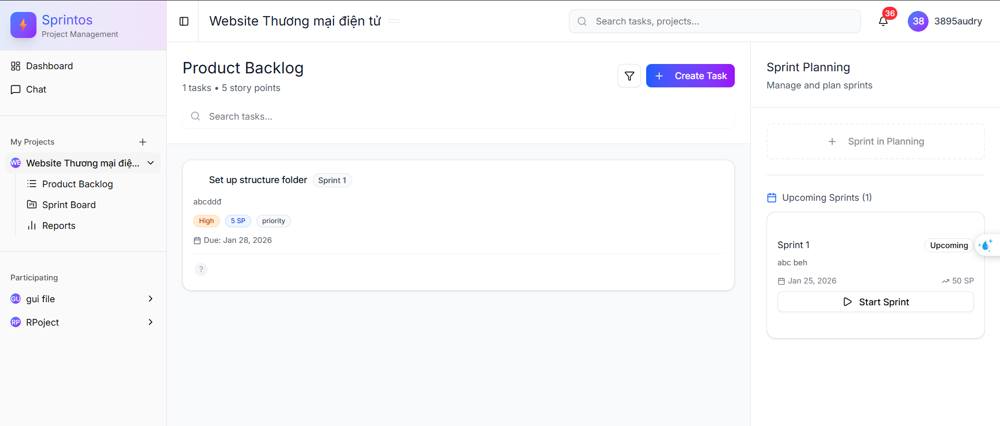
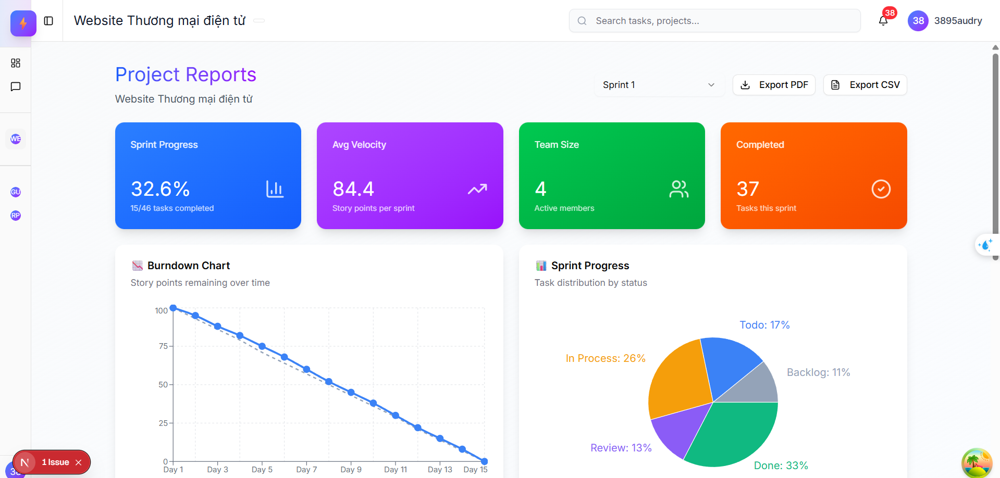
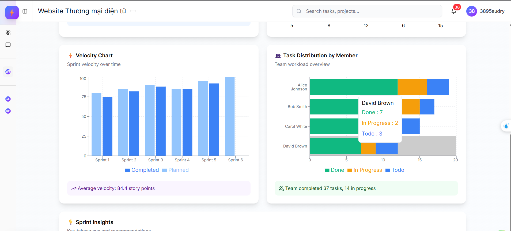

# Sprintos - Agile Project Management Platform

Sprintos is a modern Agile project management platform designed to help teams collaborate, plan sprints, and deliver projects efficiently. Built with Next.js and a rich set of UI components, Sprintos empowers teams to manage tasks, track progress, and communicate seamlessly—all in one place.

## 📋 Table of Contents

- [Introduction](#-introduction)
- [Tech Stack](#-tech-stack)
- [Features](#-core-features)
- [Installation](#-installation)
- [Project Structure](#-project-structure)
- [public/Screenshots](#-public/screenshots)
- [Checklist](#-checklist)

---

## 🎯 Introduction

**Sprintos** is a modern Agile project management platform designed to help teams collaborate, plan sprints, and deliver projects efficiently. Built with Next.js and a rich set of UI components, Sprintos empowers teams to manage tasks, track progress, and communicate seamlessly—all in one place.

---

## 🛠 Tech Stack

| Category             | Technologies               |
| -------------------- | -------------------------- |
| **Framework**        | Next.js (App Router)       |
| **Language**         | TypeScript                 |
| **State Management** | Redux Toolkit, React Query |
| **Styling**          | Tailwind CSS               |
| **Real-time**        | Socket.io                  |
| **Authentication**   | JWT                        |
| **Charts**           | Recharts                   |
| **Form**             | React Hook Form, Zod       |
| **API**              | Axios                      |

---
## Features

## ✨ Core Features
- **User Authentication & Authorization**: JWT-based authentication with access and refresh tokens
- **Project & Team Management**: Create projects, invite team members, and manage roles (Owner, Member, Viewer).
- **Sprint Planning**: Plan, create, and manage sprints with goals, timelines, and capacity.
- **Task Management**: Create, assign, and track tasks with priorities and statuses.
- **Board Columns**: Kanban-style board with customizable columns (Backlog, To Do, In Progress, Review, Done)
- **Team Collaboration**: Invite members, assign roles, and manage project permissions
- **Progress Tracking**: Burndown charts, velocity charts, and analytics for actionable insights.
- **Notifications**: Stay updated with project and task notifications.
- **Role-based Permissions**: Flexible access control for different team roles.
- **Responsive UI**: Optimized for both desktop and mobile devices.

### Real-time Features

- **Project Chat**: Real-time messaging within project rooms with file attachment support
- **Live Notifications**: Instant notifications for project activities, task assignments, and member updates
- **Typing Indicators**: Real-time typing status in project chats
- **Live Updates**: Real-time synchronization of task updates, sprint changes, and project modifications

---


## 🚀 Installation

### Prerequisites

- Node.js >= 18
- pnpm (recommended), npm, yarn, or bun

### Installation

```bash
# Clone repository
git clone https://github.com/your-username/sprintos.git
cd sprintos

# Install dependencies
pnpm install

# Copy environment variables
cp .env.example .env.local

# Run development server
pnpm dev
```

---

## 📁 Project Structure

```
├── public/                     # Static assets (images, icons, etc.)
├── src/
│   ├── app/                    # Next.js app directory (routing, pages, layouts)
│   │   └── (dashboard)/        # Dashboard-related pages and components
│   ├── components/             # Reusable React components (UI, modals, project, sprint, task, chat, etc.)
│   ├── lib/
│   │   ├── hooks/              # Custom React hooks (data fetching, mutations)
│   │   ├── services/           # API service layer (project, sprint, task, chat)
│   │   ├── types/              # TypeScript type definitions
│   │   └── utils/              # Utility functions (formatting, helpers)
│   ├── styles/                 # Global and component styles (Tailwind CSS)
│   └── ...                     # Other supporting files
├── .env                        # Environment variables
├── package.json                # Project metadata and dependencies
├── tsconfig.json               # TypeScript configuration
└── README.md                   # Project documentation
```

---

## 📸 public/Screenshots

### Dashboard

| Overview                                | Project Board                   | Team Chat                     |
| --------------------------------------- | ------------------------------- | ----------------------------- |
|  |  |  |

### Project Details

| Sprint Planning                   | Reports & Analytics                 | Team Management               |
| --------------------------------- | ----------------------------------- | ----------------------------- |
|  |  |  |

---

## ✅ Checklist

- [ ] Add more unit and integration tests
- [ ] Improve accessibility (a11y)
- [ ] Enhance mobile responsiveness
- [ ] Add more project templates
- [ ] Improve documentation

---
## 🚀 Setting

### Prerequisites

- Node.js >= 18
- pnpm (recommended) or npm

### Installation

```bash
# Clone repository
git clone https://github.com/MinhThuan1807/Task-Project-Management-Tool.git
cd sprintOs-frontend

# Install dependencies
pnpm install

# Copy environment variables
cp .env.example .env.local

# Run development server
pnpm dev
```
### Environment Variables

```env
# .env.example
NEXT_PUBLIC_API_URL='http://localhost:8080/v1/' 
NEXT_PUBLIC_SOCKET_IO_URL='http://localhost:8080'

```


Then open [http://localhost:3000](http://localhost:3000) in your browser.

- **Demo Account**: You can register a new account or use a demo account if provided.
- **Demo Projects**: Create a new project, invite team members, and explore sprints, tasks, and chat features.
- **Interactive UI**: The app auto-updates as you edit the code.

## 🔗 Links
- **Backend Repository**: [sprintOs-backend](https://github.com/QUANG221222/Sprintos-API.git)
- **Live Demo**: [sprintos-task-project-management](https://sprintsos-task-project-management.vercel.app/)

## 👤 Author
**NGUYEN MINH THUAN**

- GitHub: [MinhThuan1807](https://github.com/MinhThuan1807)
- Email: thuannm9997@ut.edu.vn

---

